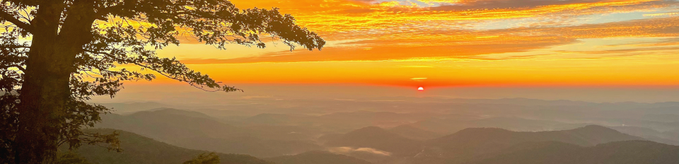

|        |        |        |    |
|--------|---------------------------------------------|--------------------|------------------------------------------|
| &nbsp;&nbsp;&nbsp;&nbsp;&nbsp;&nbsp;&nbsp;&nbsp;&nbsp; [2025 Workshop](/index.html) &nbsp;&nbsp;&nbsp;&nbsp;&nbsp;&nbsp;&nbsp;&nbsp;&nbsp; | &nbsp;&nbsp;&nbsp;&nbsp;&nbsp;&nbsp;&nbsp;&nbsp;&nbsp;&nbsp;&nbsp;&nbsp; [SCHEDULE](/2025/schedule.html) &nbsp;&nbsp;&nbsp;&nbsp;&nbsp;&nbsp;&nbsp;&nbsp;&nbsp; | &nbsp;&nbsp;&nbsp;&nbsp;&nbsp;&nbsp;&nbsp;&nbsp;&nbsp;&nbsp;&nbsp;&nbsp; [RESOURCES](/2025/resources.html) &nbsp;&nbsp;&nbsp;&nbsp;&nbsp;&nbsp;&nbsp;&nbsp;&nbsp; | &nbsp;&nbsp;&nbsp;&nbsp;&nbsp;&nbsp;&nbsp;&nbsp;&nbsp; [PREVIOUS YEARS](2025/previous.html) &nbsp;&nbsp;&nbsp;&nbsp;&nbsp;&nbsp; |

<table><tr><td>&larr; <a href="/2025/lecture2-4.html">Previous</a></td><td width="772">&nbsp;</td><td> <a href="/2025/lecture3-1.html">Next &rarr;</a></td></tr></table>
[//]: # (This is a comment. Edit the Next and Previous links above to go the right links)  

## Exercise 3-1: Estimating G-matrices in Drosophila CHCs ##

### Instructor: Jaqueline Sztepanacz ###
  
In this activity, we will be analysing data from an experiment in Drosophila 
serrata conducted by Jacqueline. She set up a paternal half-sibling breeding 
design to estimate genetic variance in male cuticular hydrocarbon (CHC) 
pheromone profile, and conducted a binomal fitness assay using these same 
individuals to get a measure of their mating success. D. serrata has 8 
well-studied CHCs that are known to be a target of sexual selection via 
female choice, and to have an important ecological role in preventing 
desiccation. We have measured these traits of interest in all offspring 
from the breeding design, and we also assayed the mating success of these 
individuals. Our goal is to better understand the genetic basis of these 
traits and whether they are under selection. In this activity we will analyse 
a subset of 4 CHC traits in order to estimate the genetic variance and 
covariance between them (ie. the G matrix), and to estimate direction and 
non-linear selection acting on these traits.

#### Script: ####
[Activity-Code.Rmd](/2025/exercise3-1/Activity-Code.Rmd)
[html output](/2025/exercise3-1/Activity-Code.html)
  
#### Data: ####
[Data.csv](/2025/exercise3-1/Data.csv)
[fullped.csv](/2025/exercise3-1/fullped.csv)

#### Background readings:  ####
[Sztepanacz & Rundle, 2012. Reduced genetic variance among high fitness individuals: Inferring stabilizing selection on male sexual displays in Drosophila serrata](/papers/SztepanaczRundle2012ReducedGeneticVarianceAmongHighFitnessIndividuals.pdf)

  
