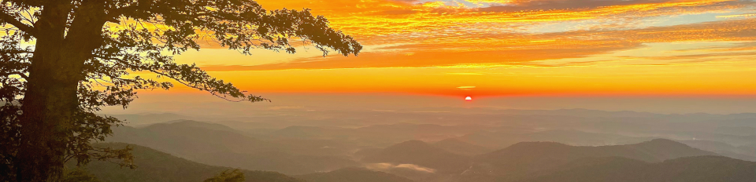

|        |        |        |    |
|--------|---------------------------------------------|--------------------|------------------------------------------|
| &nbsp;&nbsp;&nbsp;&nbsp;&nbsp;&nbsp;&nbsp;&nbsp;&nbsp; [2025 Workshop](/index.html) &nbsp;&nbsp;&nbsp;&nbsp;&nbsp;&nbsp;&nbsp;&nbsp;&nbsp; | &nbsp;&nbsp;&nbsp;&nbsp;&nbsp;&nbsp;&nbsp;&nbsp;&nbsp;&nbsp;&nbsp;&nbsp; [SCHEDULE](/2025/schedule.html) &nbsp;&nbsp;&nbsp;&nbsp;&nbsp;&nbsp;&nbsp;&nbsp;&nbsp; | &nbsp;&nbsp;&nbsp;&nbsp;&nbsp;&nbsp;&nbsp;&nbsp;&nbsp;&nbsp;&nbsp;&nbsp; [RESOURCES](/2025/resources.html) &nbsp;&nbsp;&nbsp;&nbsp;&nbsp;&nbsp;&nbsp;&nbsp;&nbsp; | &nbsp;&nbsp;&nbsp;&nbsp;&nbsp;&nbsp;&nbsp;&nbsp;&nbsp; [PREVIOUS YEARS](2025/previous.html) &nbsp;&nbsp;&nbsp;&nbsp;&nbsp;&nbsp; |

<table><tr><td>&larr; <a href="/2025/lecture1-2.html">Previous</a></td><td width="772">&nbsp;</td><td> <a href="/2025/exercise1-1.html">Next &rarr;</a></td></tr></table>
[//]: # (This is a comment. Edit the Next and Previous links above to go the right links)  

## Lecture 1-3: Evolutionary Quantitative Genetics Title ##

### Instructor: Joe Felsenstein ###
  
Description of your lecture topic. Any instructions.
  
#### Lecture projections: ####
  
##### [PowerPoint for Part 1](https://drive.google.com/file/d/19cqAs6B_RN9otFF1Er-QjH7yXwEvnuS0/view?usp=sharing) #####

##### [PDF for Part 1](https://drive.google.com/file/d/1aFZKNvKTsR2GTc_jOE99IMPOMXOtP7wM/view?usp=sharing) #####

#### Background readings:  ####

##### [Link to readings](/papers/Lande1976NaturalSelection&RandomGeneticDriftonPhenotypicCharacters.pdf) ####

#### Media/Data/Etc ####

  
